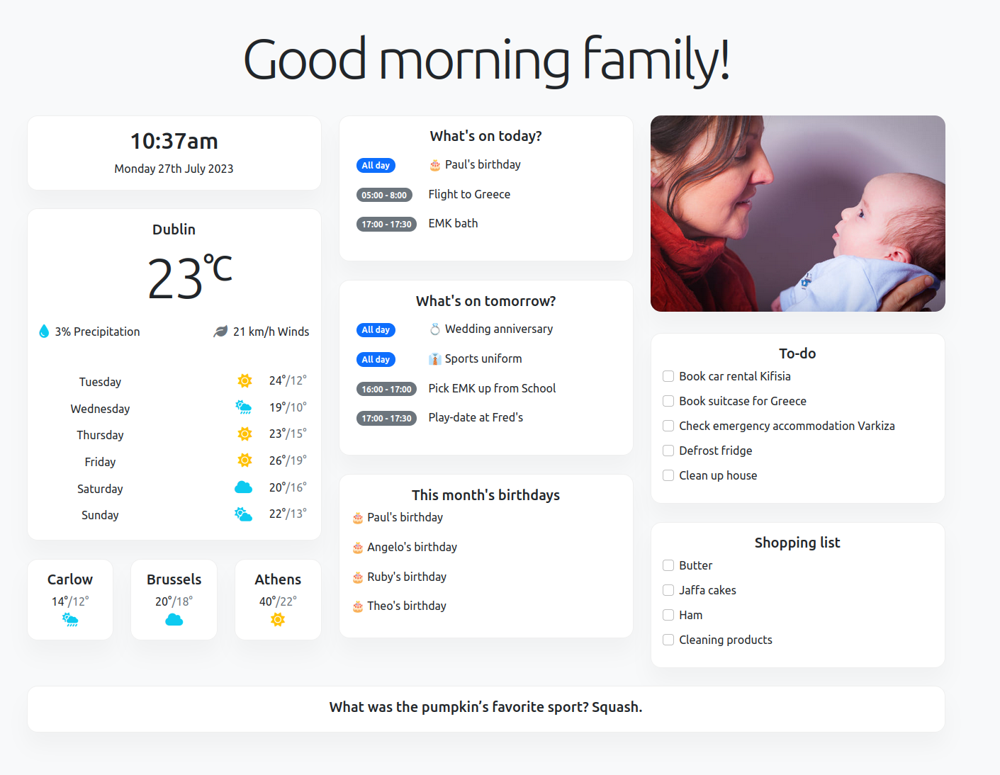

# Family portal

A portal for family organisation. 

## ⭐ About the project
A portal aimed at managing and organising the family life, to be displayed in the kitchen. Family members should be able to login and contribute to the dashboards visible to all. 

### 📷 Screenshots
 

### 🤖 Tech stack 
- Flask
- Bootstrap

### 🎯 Features
- Calendar 
- Todo list 
- Reminders 
- Weather + time
- Photos
- Dad joke of the day 
- Quote of the day
- [?] Finance management
- Shopping list 

## 🏁 Getting started 

### ‼ Prerequisites
Coming soon 

### ⚙ Installation
Coming soon 

### 🏃 Running locally 
Coming soon 

### 🧭 Roadmap
- [x] build html template 
- [ ] Start building

## Notes
Visual template: `https://demos.creative-tim.com/soft-ui-dashboard/pages/dashboard.html`
    
Ideas: `https://hackerella.com/built-digital-family-dashboard-game-changer/`

## ✉ Contact 
Made by Theo  
hello@t-o.ie
